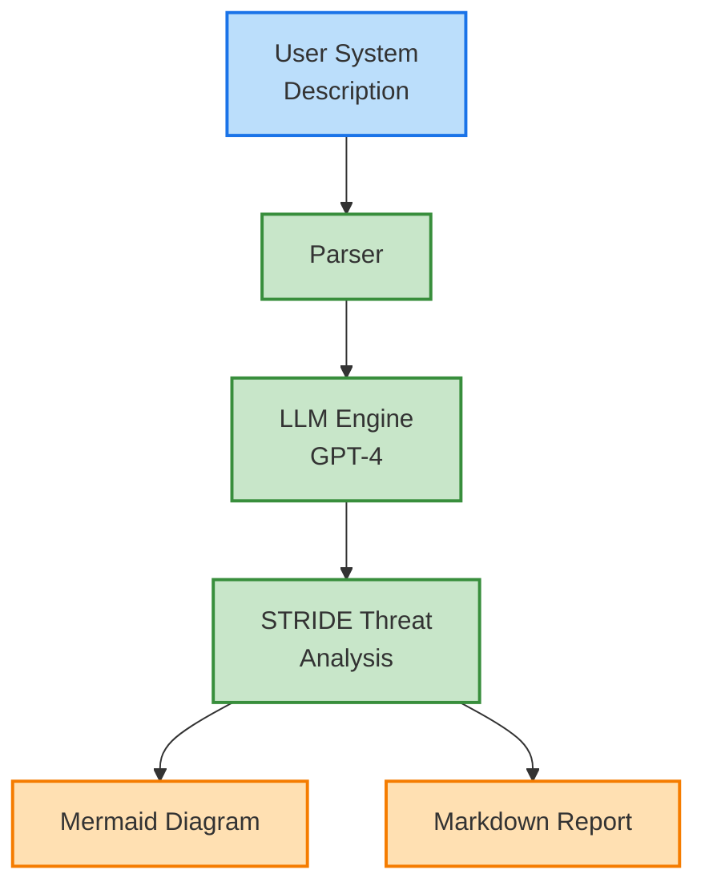

# LLMThreatModeler

LLMThreatModeler is a demonstration project that uses large language models to generate STRIDE-based threat models from high-level system descriptions. Given an architectural summary, the tool decomposes the system into components, enumerates threats, and produces a Markdown report complete with a Mermaid diagram.

## Features
- Converts free-form architecture descriptions into structured threat analyses
- Generates threat matrices with likelihood and impact scores
- Produces Mermaid diagrams illustrating trust boundaries and STRIDE categories
- Saves threat reports as Markdown files for easy sharing

## Getting Started
### Prerequisites
- Python 3.11+
- An [OpenAI API key](https://platform.openai.com/)

### Installation
```bash
pip install -r requirements.txt
```

### Usage
```bash
python modeler2.py
```
Enter a description of your system architecture when prompted. The program will create a timestamped Markdown report inside the `outputs/` directory.

## Example Output
See [example.md](example.md) for a sample system description used to drive the model.

## Architecture


## Contributing
Pull requests are welcome! For major changes, please open an issue first to discuss what you would like to change.

## License
This project is licensed under the terms of the [MIT License](LICENSE).

## Acknowledgements
- [OpenAI](https://openai.com/) for the GPT models used in analysis
- [Gradio](https://www.gradio.app/) for the user interface framework
